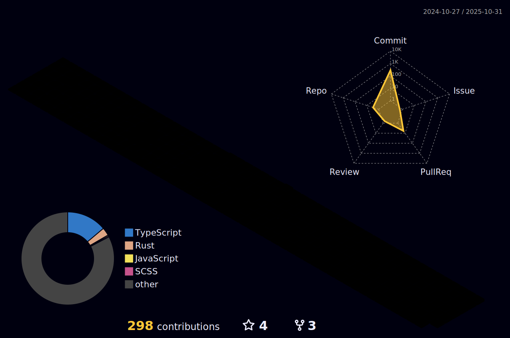

# Welcome to My GitHub Profile! 👋

Hi there! I'm Nithin, a passionate developer who loves to build and explore new technologies. This is my GitHub space where I share my projects, experiments, and contributions to the open-source community.

## About Me 🚀

- 🔭 I’m currently working on:
**[Grup](https://github.com/NithinV404/grup)**,
**[Forklore](https://github.com/NithinV404/forklore)**
- 🌱 I’m currently learning:

- 🤝 I’m looking to collaborate on: **Full Stack Development**, **CI/CD**, **DevOps**, **Rust**

- 😄 Pronouns: **He/Him**

## My Projects 🛠️

Here are some of the projects I've worked on:

1. **[Grup](https://github.com/NithinV404/grup)** - A clone of linux grup command line utiliy program in rust
2. **[Forklore](https://github.com/NithinV404/forklore)** - A simple and intuitive recipe management app
3. **[N2R Technologies](https://github.com/NithinV404/N2R-Technologies)** - An e-commerce PC parts website
4. **[People for Animals](https://github.com/NithinV404/peopleforanimals)** - An animal rescue shelter management website

Feel free to explore my repositories for more!

## GitHub Contributions 📈

## Skills 🧠g

### Programming Languages

### Frameworks & Libraries

### Tools & Technologies

## Let's Connect! 🌐

- 
- 

Feel free to reach out if you'd like to collaborate or just chat about tech! 😄

---

⭐️ From [NithinV404](https://github.com/NithinV404)
